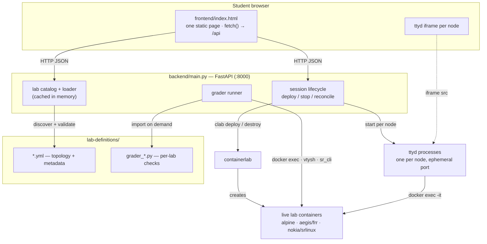
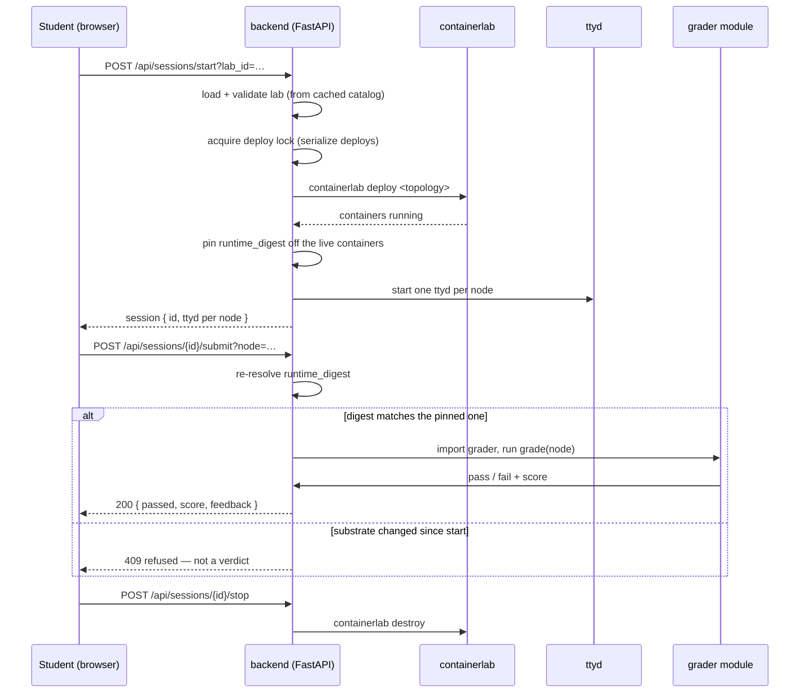

# AEGIS — Architecture

How the pieces fit: what runs where, how a lab starts, and how a config becomes a grade.
Every claim here is read off this tree, not aspirational. Paths are relative to the repo root.

---

## In one paragraph

A single Linux host runs one FastAPI process (`backend/main.py`) on `:8000`. That process
serves a static student page (`frontend/index.html`), discovers lab topologies from
`lab-definitions/`, drives **containerlab** to deploy real containers, wires a **ttyd**
terminal into each node, and grades a student's configuration by inspecting the **live**
containers with a per-lab Python grader. There is no cloud dependency, no database, and no
per-user service — state lives in the process and in the running containers.

---

## Component diagram

---

## Components

| Path | Role |
|---|---|
| `backend/main.py` | The whole server: FastAPI app, lab discovery/validation, session lifecycle, ttyd wiring, the grader runner, and the runtime-digest gate. Single file by design. |
| `frontend/index.html` | The student UI — one static HTML page (no build step, no framework). Talks to the API with `fetch()` and embeds one `ttyd` iframe per node. |
| `lab-definitions/**/*.yml` | Lab topologies with a `metadata:` block (id, name, gradeable nodes, grader module, daemons). containerlab consumes the `topology:` half. |
| `lab-definitions/grader_*.py` | Per-lab graders. Imported on demand; implement the two-function interface documented in [`ADDING-A-LAB.md`](ADDING-A-LAB.md). |
| `install.sh` | One-command host setup: Docker, containerlab, ttyd, Python deps, the app copy to `/opt/aegis`, the substrate image, pre-pulled node images, and the systemd unit. |
| `start_server.py` | Foreground launcher for running without the service (see the caveat in [`OPERATIONS.md`](OPERATIONS.md)). |
| `Dockerfile.frr` | Builds the `aegis/frr:latest` substrate — Alpine + FRR with **only** `zebra` and `staticd`; the build asserts `ospfd=no`/`bgpd=no`. |
| `Dockerfile.frr-bgp` | A separate, tested-option image for dynamic-routing labs. Not part of the shipped substrate. |
| `assets/frr-image.pin` | Content-addressed pin (layer chain + tarball sha256) that `install.sh` verifies the loaded substrate against. |
| `tools/` | Maintenance scripts: `check_self_contained.py` (clone-and-install completeness), `lint_lab_pack.py`, `check_bundle_fresh.sh`. |
| `.github/workflows/ci.yml` | CI: backend compiles, `bash -n install.sh`, self-containment check, secret scan. |

---

## Lab lifecycle

- **Deploys are serialized.** A process-wide `_DEPLOY_LOCK` guards `start`, because
  containerlab creates a shared `clab` docker network that two concurrent first-deploys would
  race.
- **Lab definitions are cached in memory** and read once per process; edit a YAML/grader and
  re-grade and you get the old result until `POST /api/labs/reload`.
- **Reconcile on startup:** the server reattaches to containers and reaps orphans rather than
  assuming a clean slate.

---

## The grading path, and why it can refuse

A grade is a **verdict only when the node could actually be examined.** The grader inspects the
running node over `docker exec` (via `vtysh` for FRR, `sr_cli` for SR Linux). Two gates matter:

- **Identity gate** — each session pins a `runtime_digest` read off the live containers at
  start. Grading re-resolves it and **refuses** (HTTP `409`) if the substrate changed, so a
  grade can't be cited against a substrate it wasn't measured on.
- **Examinability gate** — a node that is down, or a lab with no grader, produces a **refusal**,
  not a silent `pass`/`fail`.

Outcomes and the full refusal vocabulary are in [`GRADING-MODEL.md`](GRADING-MODEL.md). The API
surface is listed in the [README](../README.md#api).

---

## Node substrates: what ships, what is pulled

| image | node | in the repo? |
|---|---|---|
| `alpine:latest` | the PCs | ❌ pulled at deploy time (small) |
| `aegis/frr:latest` | the router in Demo 2 | ✅ shipped as `assets/aegis-frr-image.tar.gz`, verified against `assets/frr-image.pin` |
| `ghcr.io/nokia/srlinux:latest` | the REAL switches | ❌ pulled at deploy time — **~2.35 GB** |

`install.sh` pre-pulls the two registry images before creating the service, so a blocked
registry fails early instead of at first deploy.

---

## Scope boundaries (what this architecture does *not* include)

- **Static routing only.** The substrate asserts `ospfd=no`/`bgpd=no`. No OSPF, BGP, EVPN, or VPNs
  in the shipped labs.
- **One host, no database.** Session state is in-process; a host reboot loses running labs
  (containers are not restored on boot).
- **No dynamic routing in the demo set.** `Dockerfile.frr-bgp` exists as a tested option for
  future labs but is not the shipped substrate.

---

## See also

| doc | contents |
|---|---|
| [`OPERATIONS.md`](OPERATIONS.md) | bundle rebuild, runtime digests, concurrency, running without the service, known drift |
| [`ADDING-A-LAB.md`](ADDING-A-LAB.md) | the metadata schema, load-time validation, the grader interface |
| [`GRADING-MODEL.md`](GRADING-MODEL.md) | pass / fail / refused, lab verdict, the digest gate |
| [`GITHUB-PLAN.md`](GITHUB-PLAN.md) | repo-hardening backlog |
